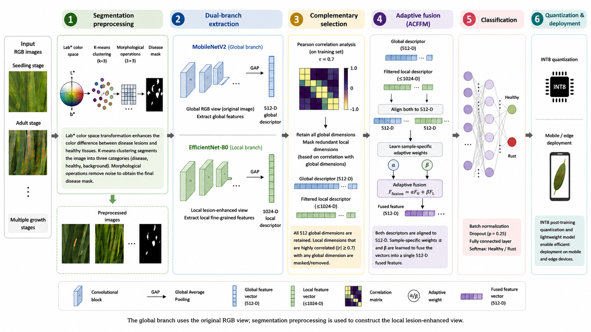
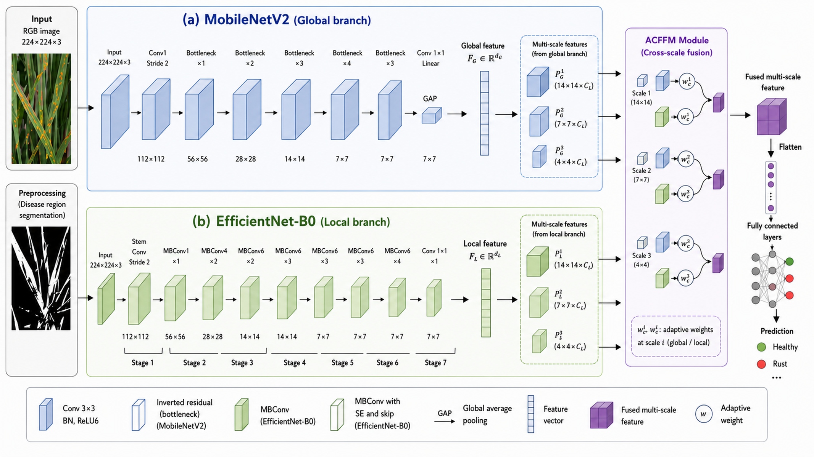

# CF2-WRD

**Manuscript-aligned reference implementation (v1.1.0)** for:

> **Image-Based Detection of Wheat Stripe Rust Using a Dual-Branch Neural Network with Complementary Feature Fusion**

Authors: **Bojian Guo, Xin Li, Temirbaeva Nazgul Ismanovna**  
Repository: **https://github.com/42328540G/CF2-WRD-GitHub**

CF2-WRD is a binary image-level classifier for **healthy wheat vs. wheat stripe rust**. The final manuscript implementation uses two branch-level descriptors: a MobileNetV2 global branch operating on the RGB view and an EfficientNet-B0 local branch operating on a Lab/K-means lesion-enhanced view. Training-set Pearson correlation is used to construct a fixed activity mask for redundant local feature dimensions, after which ACFFM performs sample-adaptive vector-level fusion with a fixed 8.99 M-parameter architecture.

<p align="center">
  
</p>

## Final method definition

### Inputs and preprocessing

Each image is resized to **224 × 224**. During training, the configured augmentation pipeline includes random rotation (±15°), horizontal flipping, Gaussian blur, and brightness perturbation.

Two synchronized views are constructed:

- **Global view:** augmented RGB image.
- **Local view:** lesion-enhanced RGB image generated from the same RGB view using:
  - RGB → Lab conversion;
  - K-means clustering with **K = 3**;
  - yellow/orange-yellow candidate selection using Lab `a*`, `b*`, and region-area information;
  - **3 × 3** erosion and dilation;
  - suppression of non-lesion regions to emphasize the candidate lesion area.

The manuscript specifies the qualitative Lab/color/area criterion but does not give all numerical scoring constants or augmentation probabilities. The repository exposes those implementation defaults in `configs/cf2_wrd.yaml`.

### Dual-branch encoder

<p align="center">
  
</p>

**Global branch — MobileNetV2**

- ImageNet initialization;
- first **3** feature blocks frozen;
- global average pooling;
- linear projection to **512-D** descriptor `F_G`.

**Local branch — EfficientNet-B0**

- ImageNet initialization;
- first **5** feature blocks frozen;
- global average pooling;
- linear projection to **1024-D** descriptor `F_L`.

The final implementation performs **vector-level fusion only**. Intermediate multi-scale feature maps are not fused.

### Pearson complementary feature selection

The final manuscript rule is implemented exactly in `cf2wrd/selector.py`.

For every local dimension `j`, compute its maximum absolute Pearson correlation with all global dimensions:

```text
m_j = max_i |rho_ij|
```

with the correlation matrix fitted **only on the training split**. All global dimensions are retained. A local dimension is active iff:

```text
m_j <= 0.7
```

The resulting local-feature activity mask is frozen and applied unchanged to validation and test data. **No minimum-dimension fallback is used.** The network retains the full 1024→512 local projection parameters; active indices select the participating local inputs and matching weight columns, so the stored parameter count remains fixed.

### ACFFM

The complete global descriptor and the Pearson-masked local descriptor are mapped to a common **512-D** space. The local alignment layer remains fully parameterized as 1024→512, while forward computation uses only active input dimensions and matching weight columns. ACFFM learns one score for each branch and normalizes the pair with Softmax:

```text
[alpha, beta] = softmax([s_G, s_L])
F_fused = alpha * F'_G + beta * F'_L
```

The fused vector is passed through BatchNorm, Dropout (`p = 0.25`), and a 2-class fully connected classifier.

---

## Dataset

The study reports a self-built dataset containing **64,232 RGB images** collected across seedling and adult growth stages.

| Growth stage | Class / stage label | Train | Validation | Test | Total |
|---|---:|---:|---:|---:|---:|
| Seedling | Healthy | 14,080 | 1,760 | 1,760 | 17,600 |
| Seedling | Rust (early) | 7,040 | 880 | 880 | 8,800 |
| Seedling | Rust (late) | 7,040 | 880 | 880 | 8,800 |
| Adult | Healthy | 11,608 | 1,454 | 1,454 | 14,516 |
| Adult | Rust (outbreak) | 5,824 | 728 | 728 | 7,280 |
| Adult | Rust (severe) | 5,784 | 726 | 726 | 7,236 |
| **Total** | — | **51,376** | **6,428** | **6,428** | **64,232** |

The split ratio is **8:1:1**, with all images from the same plant or acquisition batch assigned to only one split to reduce information leakage.

Stripe-rust labels were determined by plant pathology specialists using artificial inoculation records together with visual assessment of symptoms.

### Data availability

The image dataset is **not included in this public repository**. According to the manuscript, the datasets generated and analyzed during the study are available from the corresponding author upon reasonable request.

A metadata template and group-aware splitting utility are provided under `data/`.

---

## Manuscript-reported results

The numbers below are **results reported in the manuscript**; they are not regenerated automatically by this repository because the private image dataset and manuscript training checkpoint are not included.

| Model / framework | Accuracy (%) | Precision (%) | Recall (%) | F1 (%) | Seedling Acc. (%) | Adult Acc. (%) | Mean abs. cross-branch corr. |
|---|---:|---:|---:|---:|---:|---:|---:|
| MobileNetV2 | 88.7 | 88.1 | 87.3 | 87.7 | 86.2 | 90.1 | — |
| RepViT | 89.8 | 89.2 | 88.5 | 88.8 | 87.5 | 91.3 | — |
| EfficientNet-B0 | 89.5 | 90.6 | 88.9 | 89.7 | 88.3 | 90.5 | — |
| ResNet50 | 90.3 | 90.8 | 89.6 | 90.2 | 88.9 | 91.5 | — |
| RustNet | 86.5 | 86.2 | 84.8 | 85.5 | 84.1 | 88.2 | — |
| Direct concatenation | 91.6 | 91.9 | 91.1 | 91.5 | 90.2 | 92.5 | 0.42 |
| Fixed-weight summation | 91.9 | 92.2 | 91.3 | 91.7 | 90.5 | 92.8 | 0.42 |
| CBAM concatenation | 92.2 | 92.6 | 91.7 | 92.1 | 91.0 | 93.0 | 0.38 |
| Bilinear fusion | 91.7 | 92.0 | 91.2 | 91.6 | 90.3 | 92.6 | 0.40 |
| **CF2-WRD** | **95.3** | **95.7** | **94.5** | **94.9** | **94.1** | **96.1** | **0.27** |
| **CF2-WRD (INT8)** | **94.5** | **95.0** | **93.8** | **94.4** | **93.3** | **95.3** | **0.27** |

Reported deployment values:

| Model | Params (M) | Mobile FPS | Jetson TX2 FPS |
|---|---:|---:|---:|
| CF2-WRD | 8.99 | 16.9 | 12.8 |
| CF2-WRD (INT8) | 8.99 | 23.0 | 19.2 |

The paper's FPS protocol uses batch size 1, 50 warm-up runs, and 500 timed inference runs. Reported FPS is model inference only.

### Parameter-count verification status

The finalized vector-level architecture contains **8,989,568 stored parameters**, reported as **8.99 M** after rounding. Pearson feature selection is implemented as a fixed activity mask/sparse projection policy and therefore does **not** change the stored parameter count. INT8 quantization changes numerical precision, not the number of parameters.

The repository does not infer model-file size from parameter count; exported artifact size depends on the deployment format and should be reported only from the actual finalized export. Run `python scripts/verify_release.py --config configs/cf2_wrd.yaml` to verify the fixed parameter count.

---

## Installation

The manuscript reports:

- PyTorch 2.1.0
- TorchVision 0.16.0
- OpenCV 4.8.0
- Scikit-learn 1.3.0
- TensorFlow Lite 2.14.0
- Matplotlib 3.8.0

Conda:

```bash
conda env create -f environment.yml
conda activate cf2wrd
pip install -e .
```

Pip:

```bash
pip install -r requirements.txt
pip install -e .
```

---

## Prepare dataset metadata

Copy the template:

```bash
cp data/metadata_template.csv data/metadata.csv
```

Expected columns:

```text
image_path,label,growth_stage,disease_stage,device,group_id
```

If the exact original splits are available, place them at:

```text
data/splits/train.csv
data/splits/val.csv
data/splits/test.csv
```

Otherwise, create leakage-aware group splits:

```bash
python scripts/make_splits.py   --metadata data/metadata.csv   --output-dir data/splits   --group-col group_id   --seed 42
```

Group-wise resplitting may not reproduce the exact manuscript image counts unless the original split identifiers are used.

---

## Train

```bash
python scripts/train.py --config configs/cf2_wrd.yaml
```

Training performs the following sequence:

1. build ImageNet-initialized dual-branch encoder;
2. create a deterministic, non-augmented view of the **training split only**;
3. fit the Pearson selector and freeze the local activity indices;
4. train the final classifier for 60 epochs using AdamW;
5. save the fixed local activity indices in the checkpoint.

The manuscript does not specify AdamW weight decay or all augmentation probabilities. These are explicit configurable release defaults rather than hidden assumptions.

---

## Evaluate

```bash
python scripts/evaluate.py   --config configs/cf2_wrd.yaml   --checkpoint checkpoints/cf2_wrd_best.pt   --split test
```

The evaluation script reports overall binary metrics and growth-stage metrics when `growth_stage` metadata are available.

---

## Inference

```bash
python scripts/inference.py   --config configs/cf2_wrd.yaml   --checkpoint checkpoints/cf2_wrd_best.pt   --image path/to/image.jpg
```

---

## Visualization

t-SNE:

```bash
python scripts/tsne_visualization.py   --config configs/cf2_wrd.yaml   --checkpoint checkpoints/cf2_wrd_best.pt   --split test
```

Grad-CAM:

```bash
python scripts/gradcam.py   --config configs/cf2_wrd.yaml   --checkpoint checkpoints/cf2_wrd_best.pt   --image path/to/image.jpg   --branch efficient
```

---

## Deployment

Export ONNX:

```bash
python scripts/export_onnx.py   --config configs/cf2_wrd.yaml   --checkpoint checkpoints/cf2_wrd_best.pt
```

Model-only PyTorch benchmark:

```bash
python scripts/benchmark.py   --config configs/cf2_wrd.yaml   --checkpoint checkpoints/cf2_wrd_best.pt   --warmup 50   --runs 500
```

The manuscript reports conversion from PyTorch to TensorFlow Lite and INT8 calibration with **1,000 training images** (500 seedling + 500 adult). Because the exact PyTorch→TensorFlow Lite conversion commands used in the experiment are not available in the supplied materials, `deployment/tflite_int8_template.py` is clearly labeled as a template rather than an exact reproduction claim.

---

## Release verification

Run:

```bash
python scripts/verify_release.py --config configs/cf2_wrd.yaml
pytest -q
```

The verification script checks the final manuscript-level dimensions/settings, Pearson activity policy, and the invariant 8,989,568-parameter architecture.

---

## Repository structure

```text
CF2-WRD-GitHub/
├── README.md
├── CITATION.cff
├── RELEASE_CHECKLIST.md
├── requirements.txt
├── environment.yml
├── pyproject.toml
├── configs/
│   └── cf2_wrd.yaml
├── cf2wrd/
│   ├── data.py
│   ├── model.py
│   ├── preprocessing.py
│   ├── selector.py
│   └── utils.py
├── scripts/
│   ├── train.py
│   ├── evaluate.py
│   ├── inference.py
│   ├── benchmark.py
│   ├── export_onnx.py
│   ├── make_splits.py
│   ├── tsne_visualization.py
│   ├── gradcam.py
│   └── verify_release.py
├── deployment/
├── data/
├── checkpoints/
├── docs/
├── figures/
└── tests/
```

## Reproducibility and scope

This repository implements the **final method definition** used in the current manuscript text, including the fixed 8.99 M-parameter architecture. It does not include the private wheat image dataset or the manuscript checkpoint; therefore the reported accuracy/F1/FPS values are manuscript results rather than independently regenerated outputs of the public release.

See:

- `docs/FINAL_METHOD_SPEC.md`
- `docs/REPRODUCIBILITY.md`
- `docs/PARAMETER_COUNT_NOTE.md`

## Citation

If this work is accepted/published, please cite the final journal article. `CITATION.cff` will be updated with DOI/article metadata after publication.
